# Pathways & Navigation

Visual map of every route through the Forest4Youth Practice Guide. The
app branches at the role screen into a participant track and a
practitioner track. Square nodes are screens; rounded triple-paren nodes
are door-modules (full-page module views).

## Diagram

```mermaid
flowchart TB
    classDef role fill:#2d4a3f,stroke:#2d4a3f,color:#fff;
    classDef entry fill:#e9efe8,stroke:#2d4a3f,color:#2d4a3f;
    classDef partScreen fill:#dde7d9,stroke:#2d4a3f,color:#2d4a3f;
    classDef pracScreen fill:#d6e5f5,stroke:#1f3a5c,color:#1f3a5c;
    classDef door fill:#fff,stroke:#b8552e,color:#b8552e,stroke-width:2px;

    role([Role Screen]):::role

    role -- "I'm exploring FBT" --> entryPart{Participant Entry}:::entry
    role -- "I'm a practitioner" --> entryPrac{Practitioner Entry}:::entry

    %% PARTICIPANT TRACK
    entryPart --> pwhat[What is FBT?]:::partScreen
    entryPart --> psession[A typical session]:::partScreen
    entryPart --> pforme[Is it for me?]:::partScreen
    entryPart --> pbefore[Before your first session]:::partScreen
    pbefore --> pb_share(((What to share with practitioner))):::door
    pbefore --> pb_normal(((What is normal to feel))):::door
    pbefore --> pb_signs(((Signs it may be helping))):::door
    pbefore --> pb_bb(((Things to bring back))):::door
    pbefore --> pb_q(((Questions for first meeting))):::door

    %% PRACTITIONER TRACK
    entryPrac --> learn[Learn More]:::pracScreen
    entryPrac --> implement[Implement in Practice]:::pracScreen
    entryPrac --> reflect[Reflect &amp; Evaluate]:::pracScreen
    entryPrac --> reference[Clinical Reference]:::pracScreen
    entryPrac --> guide[Companion Guide]:::pracScreen

    learn --> mod_what(((What is FBT?))):::door
    learn --> mod_ev(((Evidence Base))):::door
    learn --> mod_contra(((Contraindications))):::door

    implement --> mod_pocket(((Pocketbook of Activities))):::door
    implement --> mod_pre(((Pre-Session Checklist))):::door
    implement --> mod_plan(((Session Structure Guide))):::door

    reflect --> mod_refself(((Practitioner Self-Reflection))):::door
    reflect --> mod_ind(((Observable Outcome Indicators))):::door
    reflect --> mod_gloss(((Key Terms))):::door

    reference --> ref_ind(((Clinical indications))):::door
    reference --> ref_con(((Contraindications))):::door
    reference --> ref_pop(((Population-specific guidance))):::door
    reference --> ref_dos(((Session dosage reference))):::door
    reference --> ref_int(((Integration with other modalities))):::door

    guide -.->|14 chapters in 4 parts| guide_parts((Foundations · Practice · Clinical · Professional))

    mod_pocket --> pocketGroups((5 thematic groups · session builder · run mode))
```

## Screen + module outline

### Role screen (#role)
- **DOM id**: `role-screen`

- **role.title** — Who is this for?
- **role.part.title** — I'm exploring forest-based therapy
- **role.part.desc** — Plain-language information about what FBT is, how sessions work, and whether it might be useful for your situation or someone you care about.
- **role.part.cta** — Continue →
- **role.prac.title** — I'm a practitioner
- **role.prac.desc** — Clinical reference, session tools, pocket guide to activities, indications and contraindications, integration with other modalities, and reflection prompts.
- **role.prac.cta** — Continue →

### Entry screen — practitioner (#)
- **DOM id**: `entry-screen`
- **Audience**: practitioner

- **entry.title** — What brings you here today?
- **entry.sub** — Select a pathway to access resources tailored to your current need.
- **Learn pathway** — Learn More — Understand the theoretical basis of forest-based therapy, the evidence, and the key principles behind it.
- **Implement pathway** — Implement in Practice — Session planning tools, a pocket guide to activities, pre/post checklists, and safety considerations.
- **Reflect pathway** — Reflect & Evaluate — Post-session reflection prompts, outcome tracking, and practitioner self-assessment tools.
- **Reference pathway** — Clinical Reference — Indications, contraindications, population-specific guidance, dosage reference, and integration with other modalities.
- **Guide pathway** — Companion Guide — The full Forest4Youth practitioner handbook. Theory, practice, clinical application, and professional context across 14 chapters.

### Entry screen — participant (#)
- **DOM id**: `entry-screen (participant subview)`
- **Audience**: participant

- **pentry.title** — What would be helpful today?
- **pentry.sub** — Plain information about forest-based therapy — what it is, what a session looks like, whether it might fit your situation, and how to prepare.
- **ppath.what** — What is FBT? — A plain explanation — what forest-based therapy is, what it isn't, and how it differs from forest bathing.
- **ppath.session** — What happens in a session? — A walk through a typical 60–90 minute session — what your practitioner does, what you might feel.
- **ppath.forme** — Is it for me? — Experience-based guidance — what the research suggests for situations like yours, and what a realistic engagement looks like.
- **ppath.before** — Before your first session — What to share with your practitioner, what's normal to feel, signs it may be helping, and questions you can ask.

### What is FBT? (#pwhat)
- **DOM id**: `pwhat-screen`
- **Audience**: participant

See [content.md](./content.md) for the full text of this screen.

### A typical session (#psession)
- **DOM id**: `psession-screen`
- **Audience**: participant

See [content.md](./content.md) for the full text of this screen.

### Is it for me? (#pforme)
- **DOM id**: `pforme-screen`
- **Audience**: participant

See [content.md](./content.md) for the full text of this screen.

### Before your first session (#pbefore)
- **DOM id**: `pbefore-screen`
- **Audience**: participant

See [content.md](./content.md) for the full text of this screen.

### Learn More (#learn)
- **DOM id**: `learn-screen`
- **Audience**: practitioner

See [content.md](./content.md) for the full text of this screen.

### Implement in Practice (#implement)
- **DOM id**: `implement-screen`
- **Audience**: practitioner

See [content.md](./content.md) for the full text of this screen.

### Reflect & Evaluate (#reflect)
- **DOM id**: `reflect-screen`
- **Audience**: practitioner

See [content.md](./content.md) for the full text of this screen.

### Clinical Reference (#reference)
- **DOM id**: `reference-screen`
- **Audience**: practitioner

See [content.md](./content.md) for the full text of this screen.

### Companion Guide (#guide)
- **DOM id**: `guide-screen`
- **Audience**: practitioner

See [content.md](./content.md) for the full text of this screen.

## Door-modules (full-page views)

When a door-module is opened, it replaces the screen with a focused
single-module page. The set is hard-coded in `applyRoute()` in `index.html`:

| Module id | Found on screen | Title (EN) |
|-----------|-----------------|------------|
| `mod-pocket` | implement | Pocket Guide to Activities |
| `mod-pre` | implement | Pre-Session Checklist |
| `mod-plan` | implement | Session Structure Guide |
| `mod-reflect-self` | reflect | Practitioner Self-Reflection |
| `mod-indicators` | reflect | Observable Outcome Indicators |
| `mod-glossary` | reflect | Key Terms |
